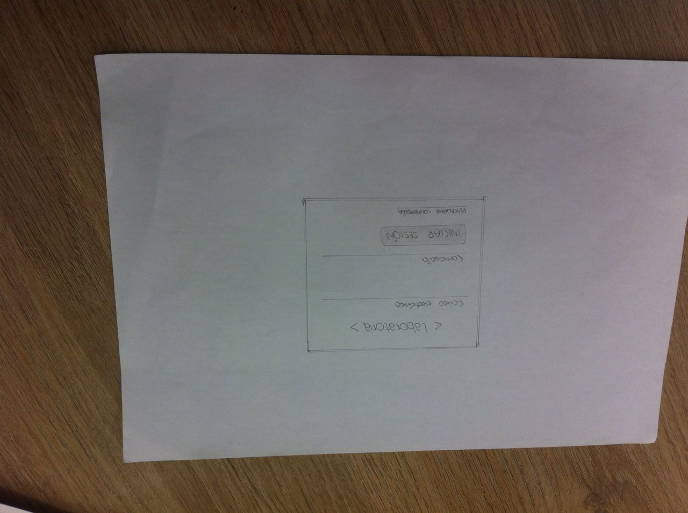
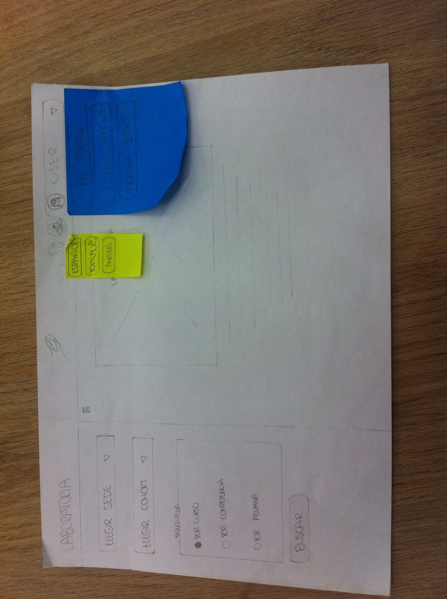
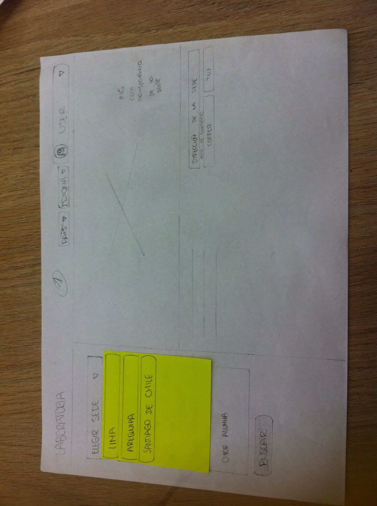
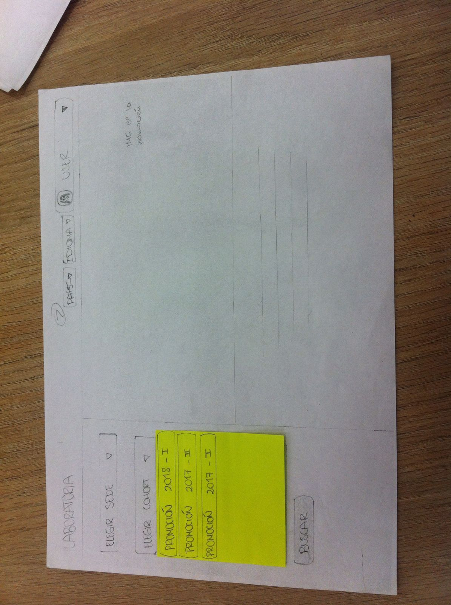
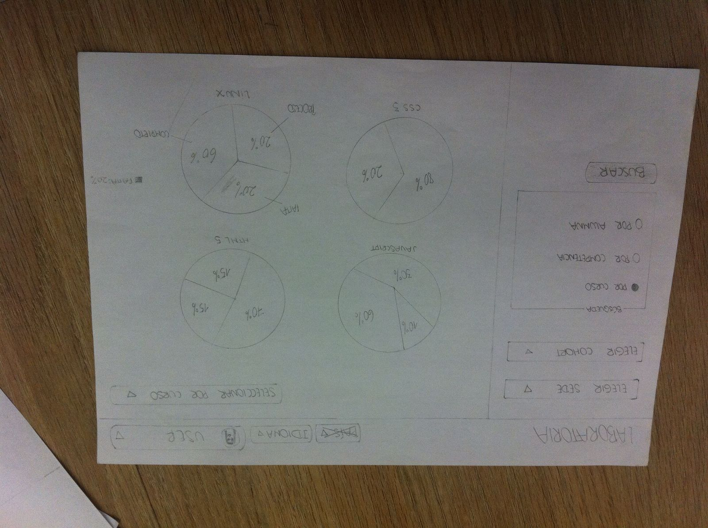
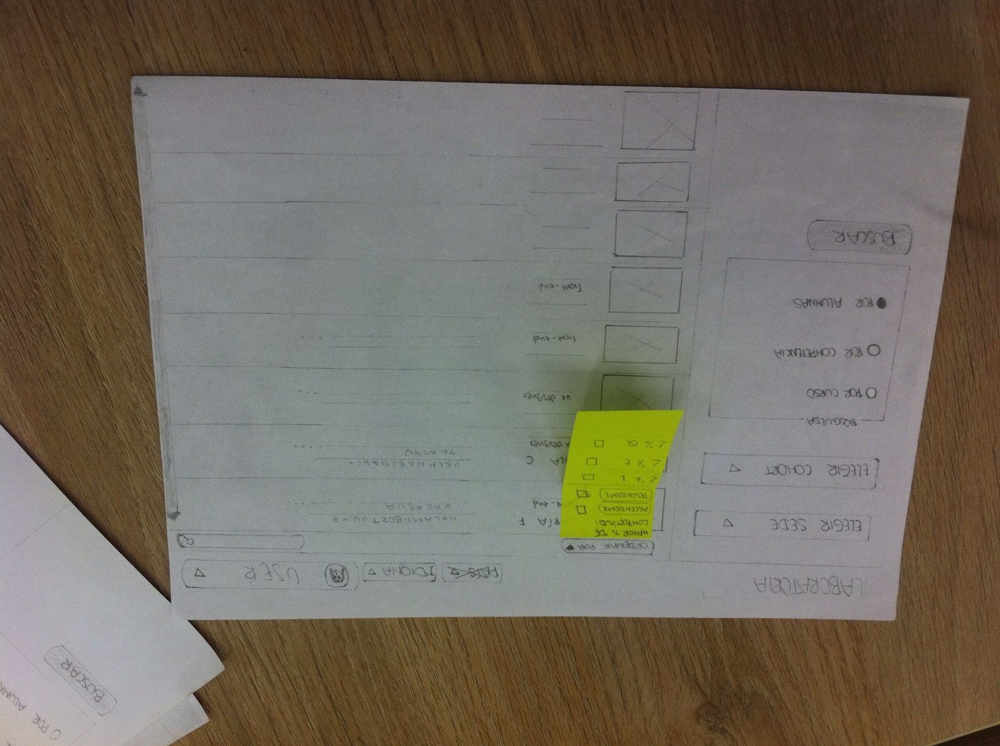
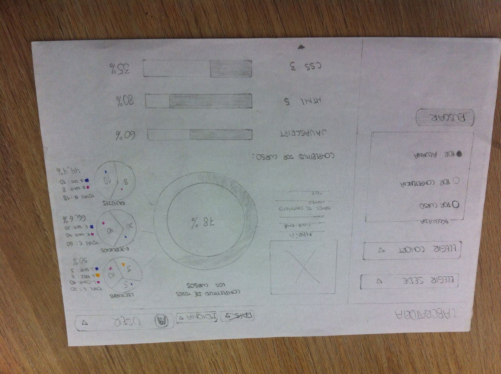

#  Definición del producto

## Principales usuarios del producto

Se identificó a los Training Manager (TM) de Laboratoria como principales usuarios, además de coaches, instructores, y personas en general que necesiten conocer el avance de un determinado cohort.

## Objetivos del usuario en relación al producto

•	Identificar cómo va cada estudiante en su proceso de aprendizaje. 
•	Visualizar estadísticamente el grado de completitud del Learning Management System (LMS) y en base a eso tener un mejor entendimiento del progreso de cada estudiante.

## Datos más relevantes de la interfaz 

La necesidad principal del usuario es conocer el avance de cada estudiante, por lo tanto los datos más relevantes que desea ver en la interfaz son las estadísticas de:
•	Los ejercicios 
•	Las lecturas 
•	Los  quizzes

Esta información le permitirá al usuario saber en qué medida las estudiantes están completando los contenidos de aprendizaje, además de conocer los resultados de las evaluaciones (quizzes). De esta forma, podrá analizar el nivel de progreso de cada persona, así como tomar decisiones más acertadas y rápidas. Se llegó a estas conclusiones por las entrevistas generadas a los principales usuarios.

##  Principal momento de revisar el producto

Se determinó que los datos son revisados por los usuarios al finalizar cada proyecto.

## Solución del producto a sus problemas

Este producto resuelve sus problemas ya que actualmente solo disponen de archivos Excel para ver el progreso de las alumnas. Con la creación de un dashboard, el usuario tendrá la información mejor organizada, mediante una interfaz que le permitirá tener una  visualización clara, ordenada y específica, además de gráficos fáciles de interpretar. Por otro lado, podrá ordenar el nivel de completitud de forma ascendente o descendente.También le permite optimizar el tiempo ya que se hace uso de las nuevas tecnologías para agilizar un proceso que podría tomar muchas horas si se hace manualmente. Un ejemplo de esto, sería buscar información precisa utilizando los filtros de búsqueda.

## El proceso de diseño

El proceso de diseño comprende 5 fases, las cuales permiten crear un producto centrado en el usuario, y que permita  satisfacer sus necesidades. Para ello,  empezamos entendiendo al usuario en la primera fase y lo seguimos involucrando a lo largo del proceso para ir validando nuestras propuestas.

#### 1) DESCUBRIMIENTO E INVESTIGACIÓN

En esta etapa identificamos quiénes serían nuestros usuarios, cuáles son sus necesidades y objetivos. Además, buscamos información sobre cómo diseñar un producto, y tableros de visualización como referencia para construir el que mejor se adecuaba a nuestros usuarios. 
Sin embargo, la parte más importante fue investigar y entender la labor que desempeñan los training mánager en Laboratoria, y el problema existente. Para esto, empleamos las siguientes técnicas: 
-Entrevistas con usuarios
-Búsquedas en la web

#### 2) SÍNTESIS Y DEFINICIÓN

En esta fase usamos los datos coleccionados en la fase de descubrimiento e investigación buscando tendencias valiosas para el desarrollo del producto, y entendemos los deseos y necesidades de nuestros usuarios.

#### 3) IDEACIÓN

En esta fase imaginamos como sería nuestro producto ideal. Para ello, cada integrante elaboró un sketch, y luego lo explicó a su compañera. A través de feedbacks, se implementó un sketch que integraba ambas ideas. Las herramientas que se utilizaron fueron: lápiz, papel y borrador. Luego se presentó el Sketch  a algunos usuarios con la finalidad de poder realizar mejoras.

De las presentaciones, se llegó a las siguientes conclusiones:
- Un botón de registro resulta innecesario ya que no es una plataforma que cualquier persona pueda  acceder.
- Poner botones en la parte de arriba y en el costado resulta confuso para el usuario 
- Se requiere gráficas generales de completitud del cohort.

#### 4) PROTOTIPADO

Luego de haber realizado mejoras al sketch, elaboramos un prototipo que nos permita probar nuestras ideas con usuarios para saber si estamos satisfaciendo sus necesidades con nuestro producto.

Se realizó un prototipado de baja fidelidad, y como principal herramienta utilizamos Figma.

#### 5) TESTEO CON USUARIOS

En esta etapa probamos nuestro prototipo con usuarios para obtener su feedback.